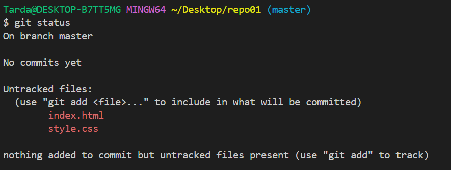
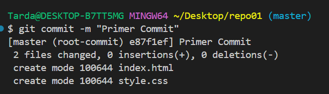
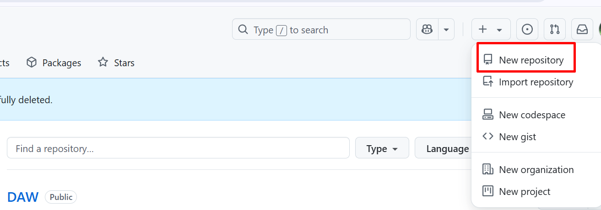

# Ej 1
  
## Creaccion del Repositorio en Local
Antes que nada viene la reaccion de la carpeta, en este caso como todo sera por CMD insertaremos este comando.

~~~
mkdir repo01
~~~

## Configuracion inicial Git Local
En la configuracion incial lo primero que hay que hacer es colocar el 'user' y 'email' que usameremos.

### Configuracion de User
#### Name
Este primer comando nos muestra el nombre usuario que hay en primera instancia.
~~~
git config user.name
~~~

Este segundo comando nos permite modificar el nombre usuario del Git.  
El agregado `--global` nos permite modigicar el usuario para todo el sistema.
~~~
git config --global user.name "Nombre del Usuario"
~~~

#### Email
Este primer comando nos muestra el mail usuario que hay en primera instancia.
~~~
git config user.email
~~~

Este segundo comando nos permite modificar el email usuario del Git.  
~~~
git config --global user.email "Email del Usuario"
~~~

### Instalacion de Git en el repositorio
A la hora de la instalacion seguiremos el siguiente codigo.

~~~
git init
~~~

## Creaccion de fichos en el repositorio y commits
Ahora que ya tenemos instalado Git dentro del repositorio vamos a crear un par de ficheos dentro del mismo.

> Creaccion de fichero `index.html` y `style.css`.

Como se puede ver en la imagen anterior, los ficheros estan creados. Pero a la derecha hay una 'U'.  
Esto nos indica que los ficheros no son traqueados. De hecho, si hacemos el comando `git status` nos indicara el comando que debemos hacer para agerarlos y que sean traqueados.

Para agregar todos los ficheros podemos solamente poner un '.' en vez del nombre de todos individualmente.

Ahora al lado donde antes aparecia una 'U' nos aparece una 'A', esto nos indica directamente el estado del fichero.

Tambien si volvemos a poner el comando `git status` se ve el cambio de estos.

Para acabar y hacer el commit hay que colocar el comando `git commit`.
Para evitar entrar en un editar y toda esa parafernalia colocamos el agregado de `-m`. Este es para colocar directamente el nombre del commit.

## Creaccion del Repositorio en GitHub
Para crear el repositorio en GitHub unicamente hay que ir 'Create New' -> 'New Repository'.

A continuacion ponemos el nombre del repositorio, en este caso 'repo01'.

Y darle a 'Create repository'.

## Enlace de GitHub y Git Local y subir cambios
Para enlazar Git Local y GitHub seguiremos los pasos que nos proporciona directamente GitHub.

El primer comando enlaza el Git Local con GitHub.

El segundo comando cambio el nombre de la rama a main.

El tercer comando es el que nos ayuda subir todos los commits dentro de Git Local a GitHub.

El comando base para subir los cambios que utilizaremos de aqui en adelante es `git push`.

[GitHub repo01](https://github.com/JorgitoslotX07/repo01)

